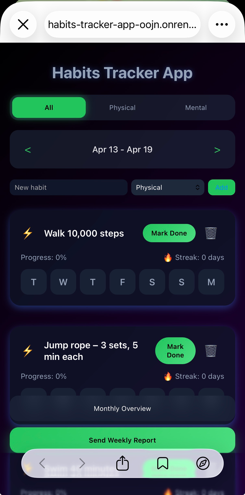
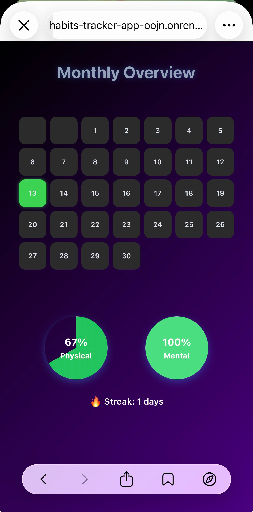
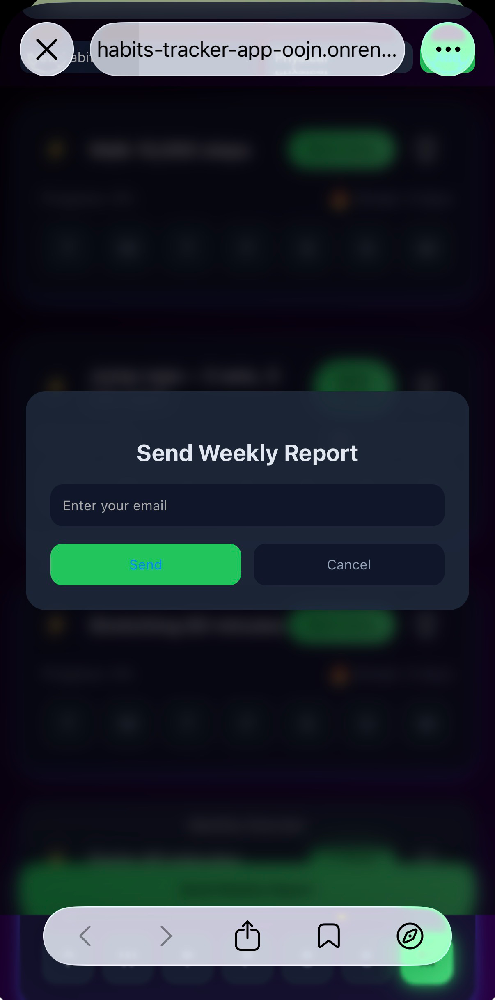

# Habits Tracker App

A modern and responsive **habit tracking application** built with Vue 3 + Vite.  
The app helps users track daily habits, visualize progress, and send weekly reports via email.

## Live Demo

👉 https://habits-tracker-app-oojn.onrender.com

## Features

-  Create and track daily habits
-  Progress statistics & analytics
-  Monthly calendar view
-  Drag & drop habit management
-  Email report system (Nodemailer + Gmail SMTP)
-  Persistent state management
-  Responsive design (mobile + desktop)

## Tech Stack

### Frontend
- Vue 3
- Vite
- Vue Router
- Vue Cal
- Vuedraggable

### UI
- FontAwesome Icons

### Backend (Email Service)
- Node.js
- Express
- Nodemailer
- CORS
- dotenv

## Application Preview

### Main Dashboard


---

### Monthly Calendar


---

### Email Report Feature


---

### 1. Clone the repository
```bash
git clone https://github.com/your-username/habits-tracker-app.git
```

### 2. Navigate to project folder
```bash
cd habits-tracker-app
```

### 3. Install dependencies
```bash
npm install
```

### 4. Run development server
```bash
npm run dev
```

The app will be available at: http://localhost:5173

### 5. Build for production
```bash
npm run build
```

### 6. Preview production build
```bash
npm run preview
```
